# 实验八 Whoami WEB综合漏洞靶场

> 一个综合性的 Web 漏洞靶场，涵盖文件下载、文件包含、文件上传、目录扫描、phpMyAdmin 弱口令、代码审计等多种技术。

## 📌 项目背景

- **靶场类型**：PHP + MySQL + phpMyAdmin + 自定义 CMS
- **攻击机**：Kali Linux + BurpSuite + 蚁剑 + 御剑 + dirsearch
- **目标**：获取网站权限，找到所有 Flag
- **作者**：韦小龙 | 网安2302班 | 2026.05

## 🔍 攻击流程（完整渗透链）

## 1️⃣ 信息收集与目录扫描

### 访问题目环境

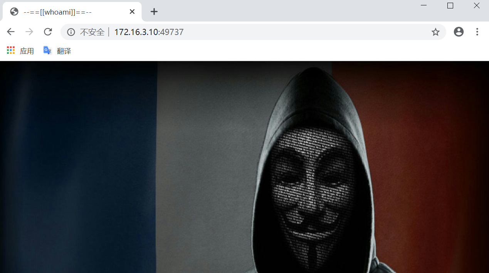

### 扫描网站目录

使用 **御剑** 扫描，发现 `/www` 目录：

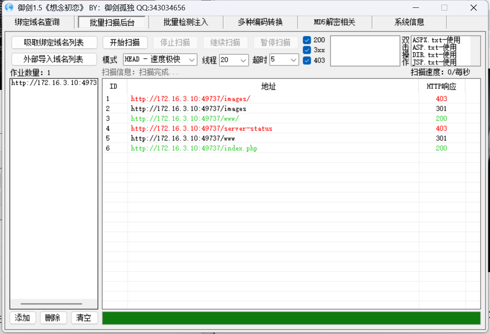

访问 `/www`，出现登录页面，尝试弱口令和万能密码均失败：

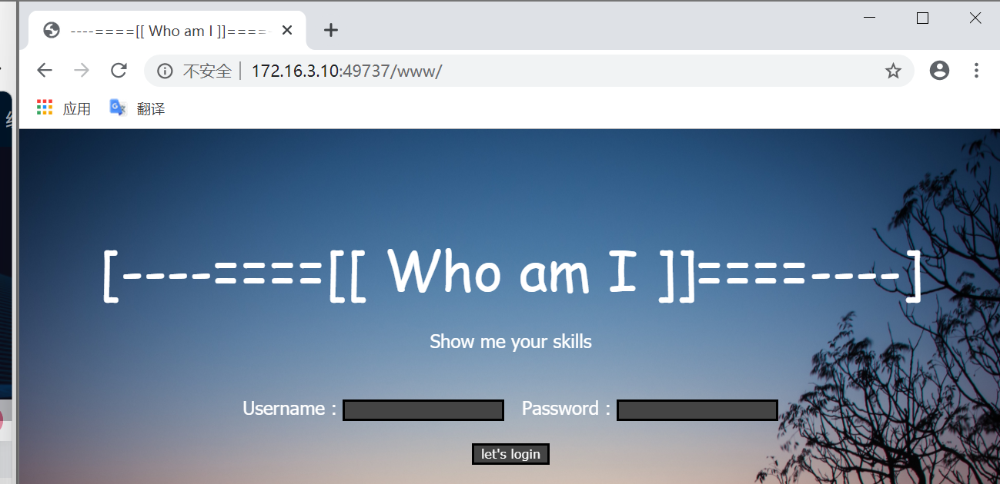

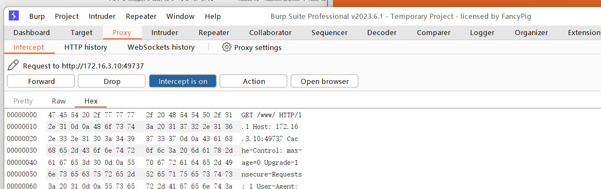

### 深度目录扫描

继续扫描 `/www` 目录下的文件，发现多个文件（结合御剑和 dirsearch）：

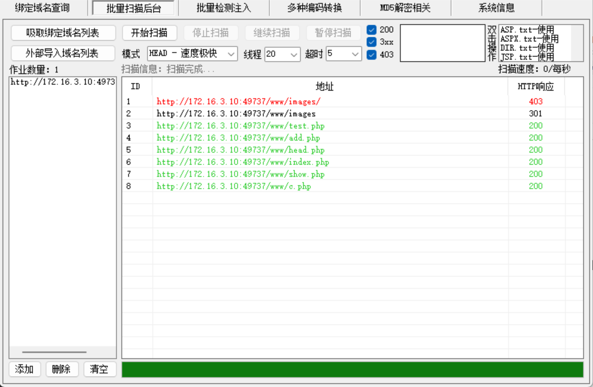

使用 `dirsearch` 扫描命令：

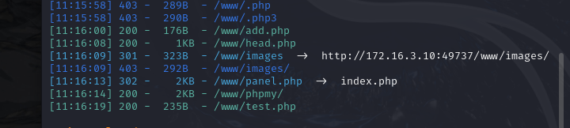

扫描到 `/phpmy` 目录。

## 2️⃣ 漏洞挖掘与利用

### 访问各个目录

- 访问 `/phpmy` → 发现 phpMyAdmin 登录页
- 访问 `add.php` → 静态上传页面
- 访问 `c.php`、`show.php` → 空白页面
- 访问 `head.php` → 一张图片
- 访问 `test.php` → 提示“缺少 file 参数”

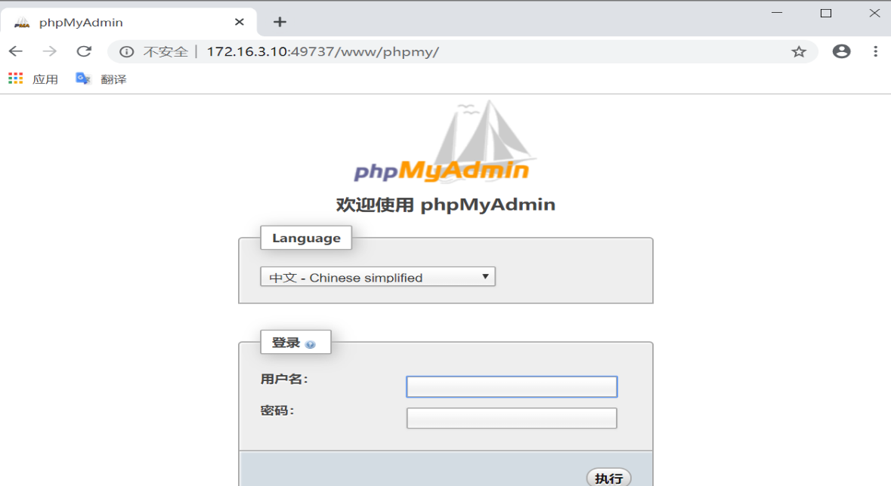

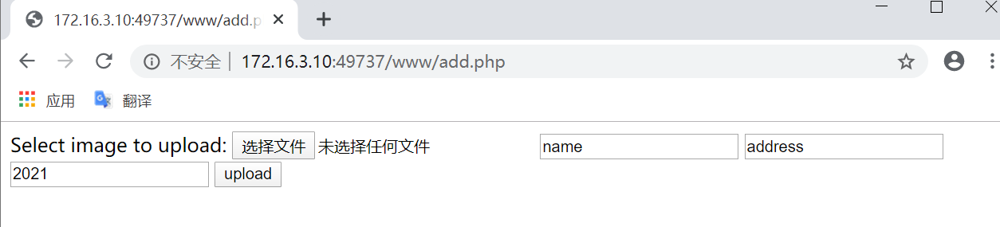

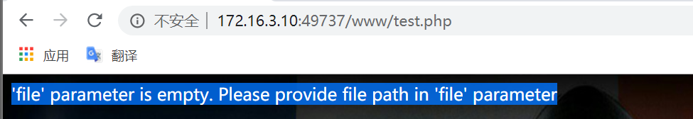

### 文件下载漏洞

在 `test.php` 后添加 `?file=index.php`，提示文件未找到：

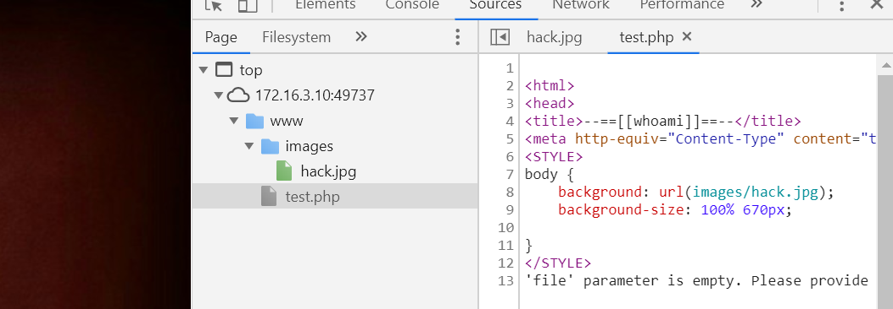

但尝试 `?file=c.php` 或其他已发现的文件，**可以成功下载源码**。  
下载 `c.php` 后，在源码中发现 MySQL 数据库的用户名和密码：

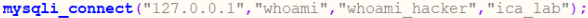

## 3️⃣ 数据库后台登录

使用获取的账号密码登录 `/phpmy`（注意目录是 `/phpmy` 不是 `phpmyadmin`）：

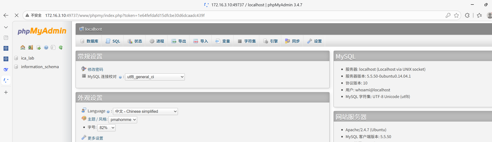

登录成功，找到 **第一个 flag**：

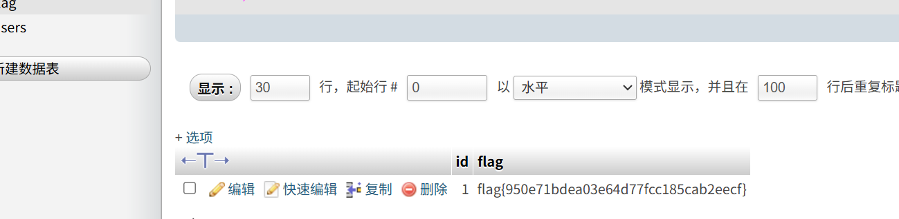

在 `auth` 表中找到网站后台的登录用户名和密码：

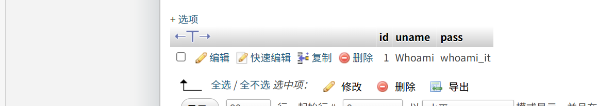

## 4️⃣ 网站后台登录与进一步渗透

使用找到的用户名密码登录网站后台：

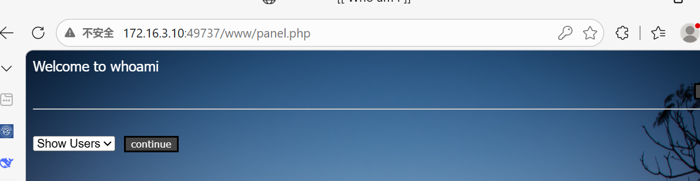

### 代码审计

利用文件下载漏洞继续下载后台源码（如 `index.php`、`config.php` 等），进行代码审计：

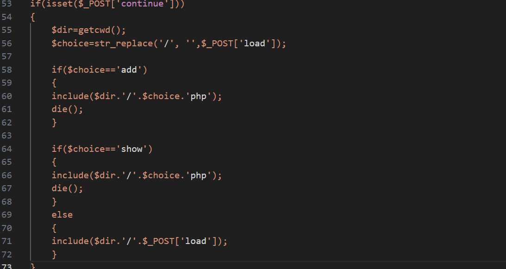

## 5️⃣ 文件上传 + 文件包含 GetShell

### 上传图片马

后台存在文件上传接口，上传一个图片马（图片内嵌一句话木马）：

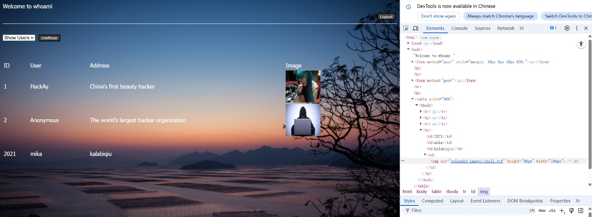

### 利用文件包含执行图片马

根据代码审计结果，存在文件包含点（`load` 参数），修改 `load` 参数指向图片马路径：

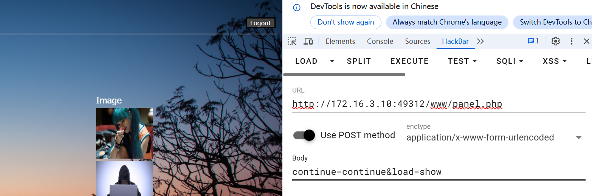

图片马路径已知：

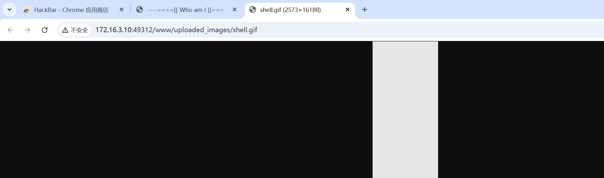

### 代码执行成功

访问包含后的页面，一句话木马被成功执行：

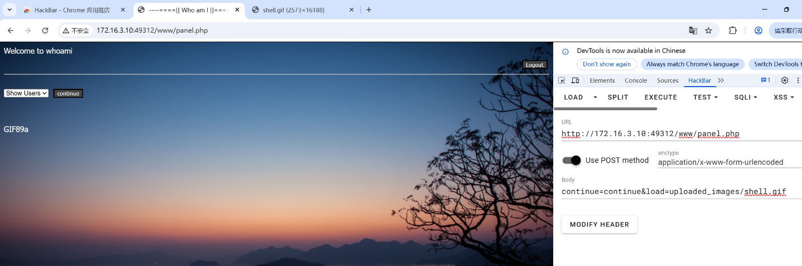

### 蚁剑连接

使用蚁剑连接 Webshell，URL 为包含点地址，密码为 `233`：

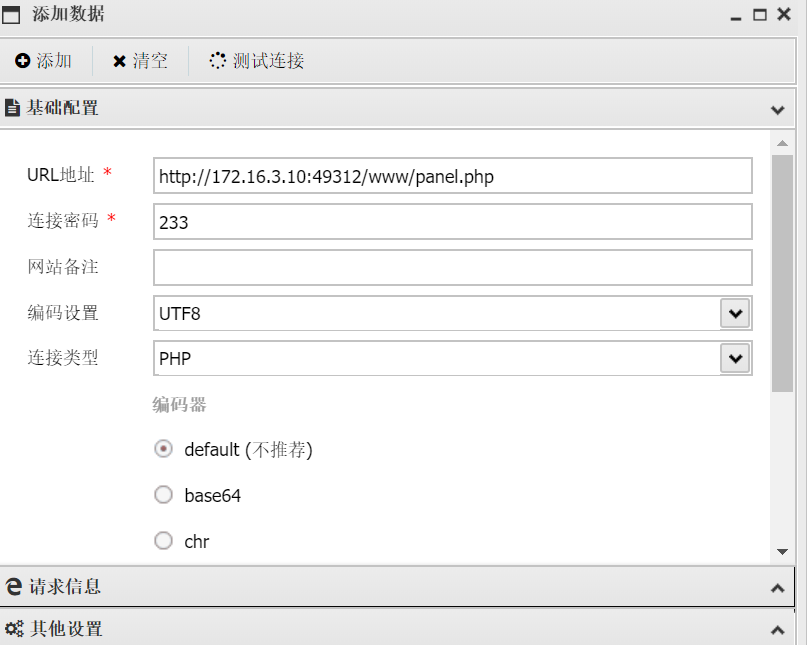

添加 HTTP Headers（保持登录状态）：

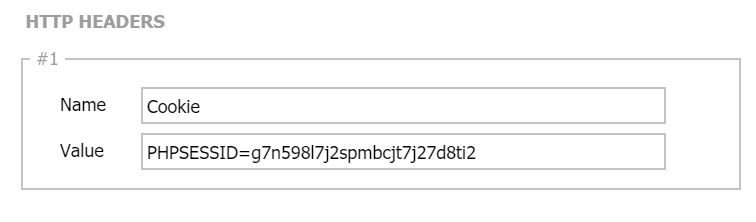

添加 HTTP Body（POST 传递命令）：

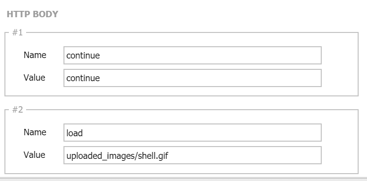

测试连接成功，获得网站权限：

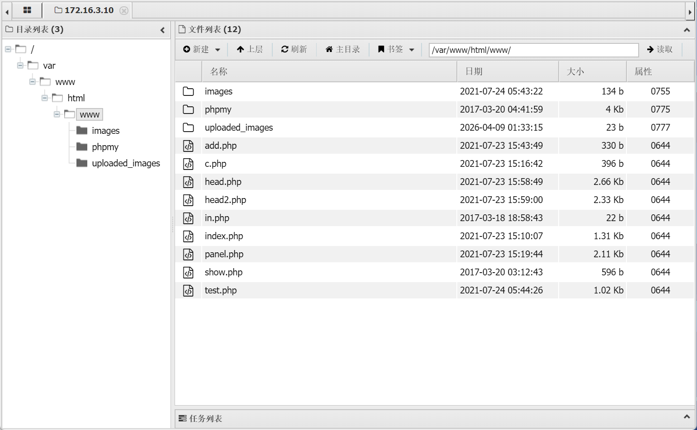

在根目录找到最终 flag：

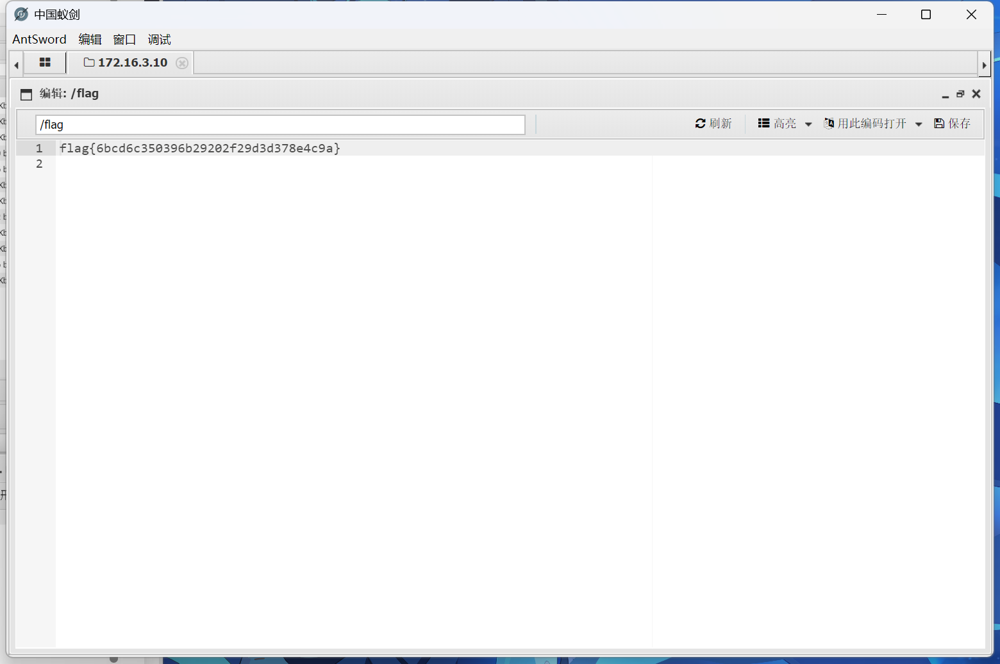

## 🛠️ 工具列表

| 工具 | 用途 |
|------|------|
| 御剑 | 目录扫描 |
| dirsearch | 目录扫描 |
| BurpSuite | 抓包、重放 |
| 蚁剑 | Webshell 管理 |
| 浏览器开发者工具 | 辅助分析 |

## 📚 知识点总结

- **目录扫描**：敏感目录泄露（`/www`、`/phpmy`、各种 `.php` 文件）
- **任意文件下载漏洞**：通过 `?file=` 参数下载源码，泄露数据库凭据
- **phpMyAdmin 弱口令**：获得数据库权限，直接读取敏感表和 flag
- **代码审计**：从源码中找到更多漏洞点（文件上传、文件包含）
- **文件上传 + 文件包含组合**：上传图片马，通过文件包含执行，获得 webshell

## 🛡️ 防御建议

1. **禁止任意文件下载**：对 `file` 参数进行白名单校验，或者使用不可预测的文件 ID 映射
2. **数据库不要使用弱口令**，且不要硬编码在可被下载的源码中
3. **phpMyAdmin 等管理工具应更改默认路径、使用强密码、限制访问 IP**
4. **后台文件上传**：校验文件类型、重命名、限制执行权限
5. **文件包含点**：使用白名单，禁止用户直接控制路径

## 📝 收获与反思

通过本次实验，我深刻体会到：

- **漏洞往往不是孤立的**：一个文件下载漏洞泄露数据库凭证 → 数据库访问获取后台密码 → 后台权限进一步审计代码找到上传+包含漏洞 → 最终 GetShell。这种层层递进的利用方式让我对“安全是整体”有了更深的理解。
- **工具的组合使用**：御剑+dirsearch 互补，能发现更多隐藏目录。
- **代码审计要细致**：一开始我忽略了 `c.php` 中的数据库密码，卡了很久，后来仔细阅读源码才发现。这提醒我审计时不能急躁。

本次实验为我今后的安全研究和开发工作打下了坚实的基础。

> 本项目仅供学习交流，请勿用于非法用途。
